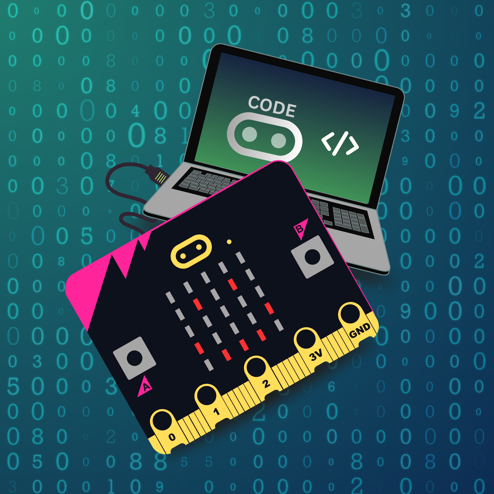

# MicroBit Curriculum by FundedYouth

This course material if freely available. If you are self-motivated person, you only need buy a Version 2 of the MicroBit and jump in with instructions provided on the MicroBit.org website. If you need more of a guiding hand, then join one of instructional sessions.

This is a hands-on curriculum. We will start with learning how to use the code editor + simulator and then transition to the physical MicroBit Hardware.

> Note: In my, Ryan, research I found the best tool for learning MicroBit is the https://makecode.microbit.org website. It contains an excellent simulator and the tutorials are great to get up and running.

## Requirements

✅ MicroBit V2 Go Kit

- MicroBit V2 Board
- USB Adapter
- Battery Pack

✅ Access to a Computer

- Windows
- Mac
- Linux
- Chromebooks

## Target Age: 3rd Grade +

**Why this age?** We presume by 3rd grade most learners have a basic ability to read and do basic mathematics. Enough to be able to understand basic logic and take instruction.

## Lessons

### 1. The Code Editor + Simulator

> Time Per Student: 30 minutes

Before touching the board we will become familiar with the code editor + simulator provided on the MicroBit.org website. **Why?** It's important that students understand how to use the tool first.

- **Project 1: Flashing Object** - Choose from pre-exising shapes
- **Project 2: Back and Forth Dot** - Make a box move one space left to right without stopping
- **Project 3: Rotating Clock Arm** - Rotate a line 360° like the big hand on a clock
- **Project 4: What is String?** - Using the "show string" block

### 2. The Microbit, Buttons, and Choices

> Time Per Student: 1 hour

Introducing butttons and the physcial MicroBit. There's nothing like seeing your code on a physical device.

- **Project 5: Go, Stop, Wait** - Using the "show string" block we will add the ability to display thee different notifications by pushing different buttons.
- **Project 6: Change Directions** - We will adapt Project 2 by making the dot switch between right to left and left to right
- **Project 7: Freeze** - We will introduce a pause effect to Project 6 using that will hold the dot in place until we release it.
- **Project 8: Countdown** - Make a count down timer that starts a random number. One button to reset and generate a random number. One button to start the timer. Two buttons to freeze the count.

### 3. Interactions

> Time Per Student: 2 hours

- **Random Meter** - We will introduce the PINS and create a little program that randomly generates a number rating. This student will first hold two ends of the MicroBit to make the code run. Then between two students they will hold a hand and then each student will touch an end to see if the meter connection still works.

- **Sending Messages** - ...
