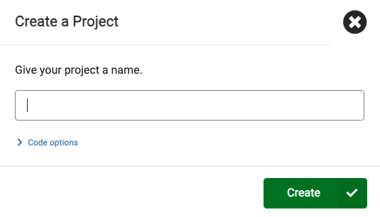

 

  <video controls style="position: absolute; top: 0; left: 0; width: 100%; height: 100%; border-radius: 12px;">
    <source src="./video/p1-back-and-forth-preview.mp4" type="video/mp4">
    Completed project of back and forth
  </video>

  

[🏠 Home](./README.md)

# Project 2: Back and Forth Dot

## Tutorial

1. Go to: https://makecode.microbit.org/
2. Select **New Project** and name it `Back and Forth Dot` and click **Create**.

   

3. First remove the **on start** block by clicking on it and dragging back into the **Toolbar**. You should see a trashcan appear.

4. From the toolbar **Basic** blocks, drag a **show leds** into the **forever** block.

5. Then Select the first bottom-left square.

 

  <video controls style="position: absolute; top: 0; left: 0; width: 100%; height: 100%; border-radius: 12px;">
    <source src="./video/microbit-makecode-p2-first-dot.mp4" type="video/mp4">
    Add show leds block and select bottom-left square / LED
  </video>

  

6. Add another **show leds** block and click on the second dot to the right of the first dot. Repeat this for each of the dots at the bottom. Watch the video below.

 

  <video controls style="position: absolute; top: 0; left: 0; width: 100%; height: 100%; border-radius: 12px;">
    <source src="./video/microbit-makecode-p2-left-to-right.mp4" type="video/mp4">
    Moving dot from the left to right setup.
  </video>

  

7. Now do the same thing but in reverse from right to left. That way it looks like the dot is bouncing from left to right back to the left. Watch the video below. - _Note: you don't need to put the dot at the start because it already exists at the beginning of the forever block._

 

  <video controls style="position: absolute; top: 0; left: 0; width: 100%; height: 100%; border-radius: 12px;">
    <source src="./video/microbit-makecode-p2-back-and-forth.mp4" type="video/mp4">
    Dot moving back and forth
  </video>

  

> Project Completed
