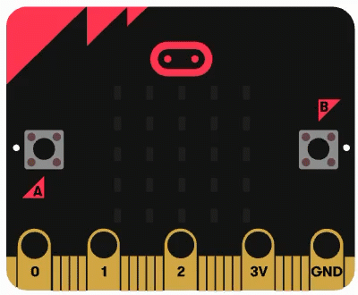

[🏠 Home](./README.md)

# Project 1: Flashing Object

1. Go to: https://makecode.microbit.org/
2. Select **New Project** and name it `Flashing Object` and click **Create**.

   

3. First remove the **on start** block by clicking on it and dragging back into the **Toolbar**. You should see a trashcan appear.

 

  <video controls style="position: absolute; top: 0; left: 0; width: 100%; height: 100%; border-radius: 12px;">
    <source src="./video/microbit-makecode-delete-by-dragging-to-toolbar.mp4" type="video/mp4">
    Delete Block by Dragging to Toolbar
  </video>

  

4. Under the **Toolbar** click on **Basic** to reveal the `Basic Blocks`
5. The select the **show icon** block and `drag it into` the **forever** block.
6. Click on the shape drop-down and choose a shape you like.
7. Then **look at the simulator** on the left. It will show the shape.

 

  <video controls style="position: absolute; top: 0; left: 0; width: 100%; height: 100%; border-radius: 12px;">
    <source src="./video/microbit-makecode-p1-add-basic-show-icon.mp4" type="video/mp4">
    Add Basic > Show Icon Block to Forever Block
  </video>

  

8. Drag a **show leds** block from **Basic** into the **forever** block under the **show icon** block.

 

  <video controls style="position: absolute; top: 0; left: 0; width: 100%; height: 100%; border-radius: 12px;">
    <source src="./video/microbit-makecode-p1-add-show-leds.mp4" type="video/mp4">
    Add 'show leds' block to `forever` block
  </video>

  

> Project Complete !!!
